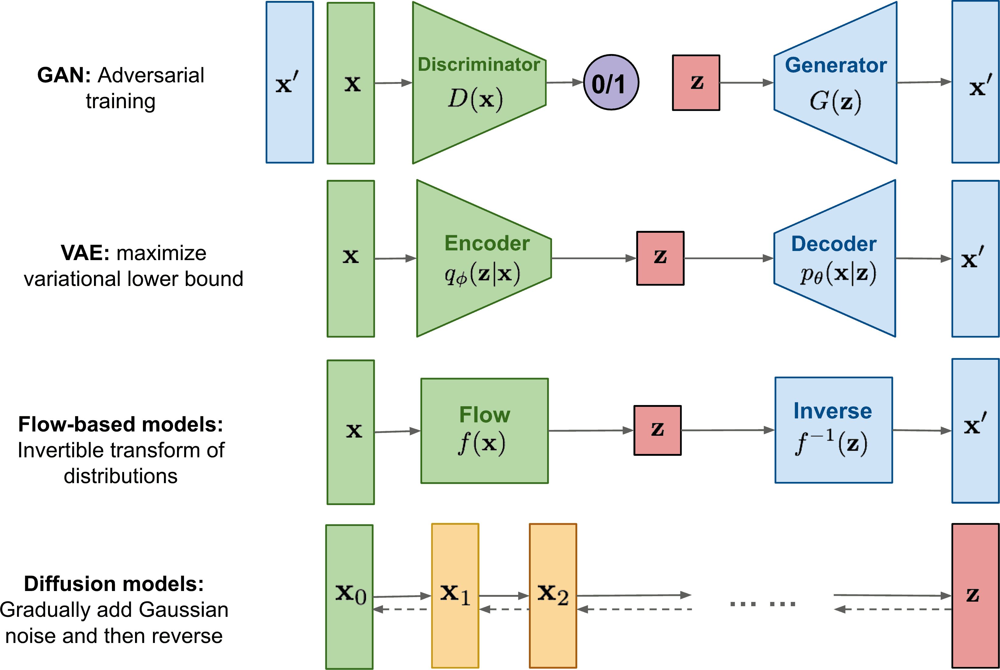
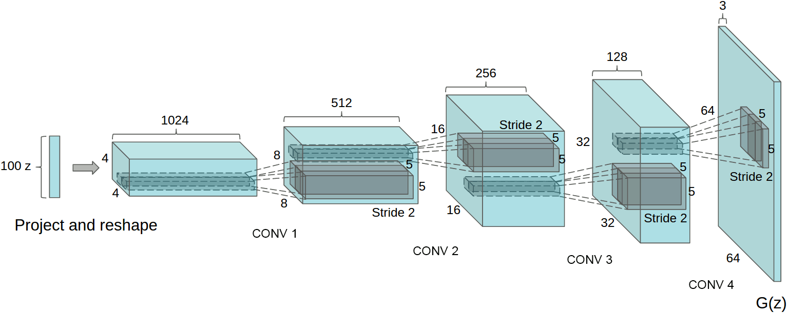
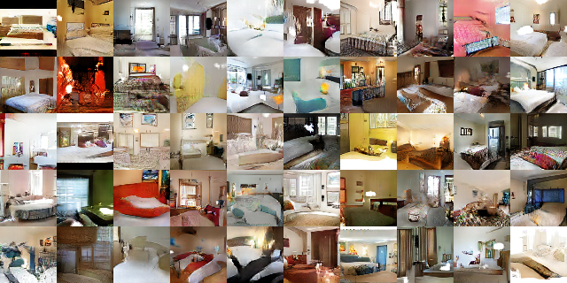
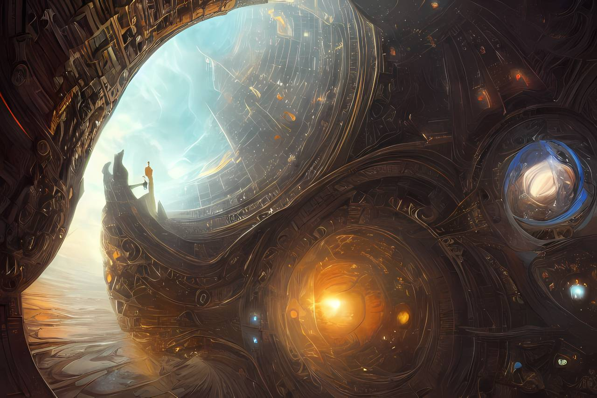
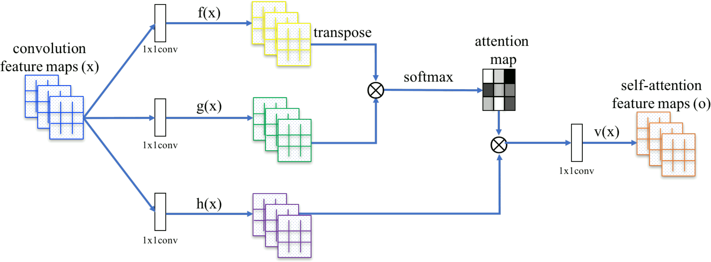
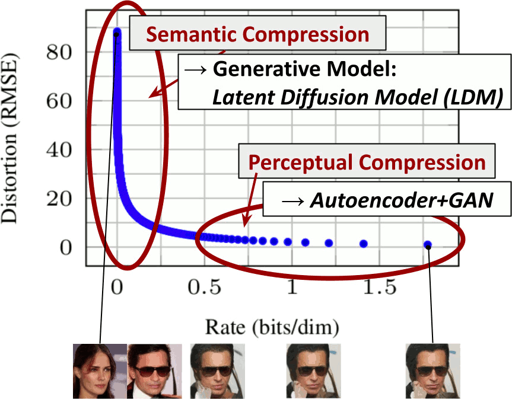
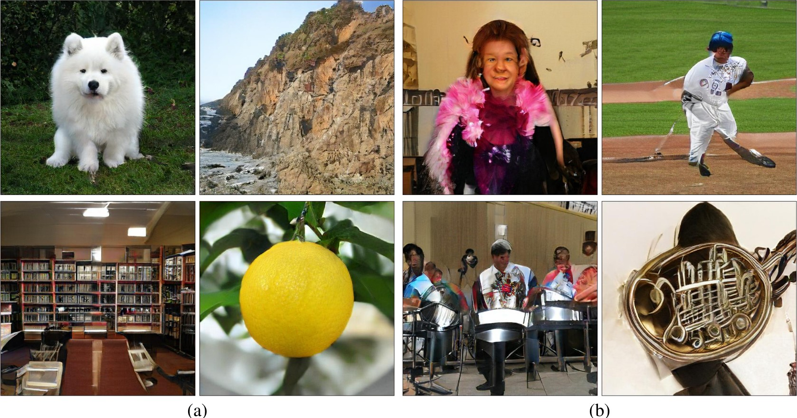
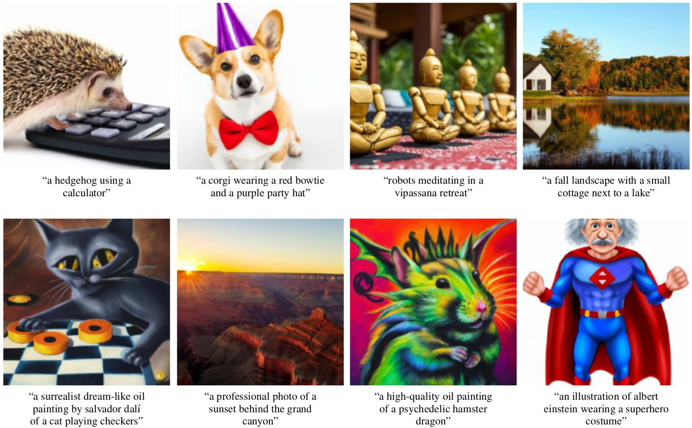

title: NPFL114, Lecture 13
class: title, langtech, cc-by-sa

# Generative Adversarial Networks, Diffusion Models

## Milan Straka

### May 9, 2023

---
# Generative Models

There are several approaches how to represent a probability distribution
$P(⁇→x)$. **Likelihood-based models** represent the probability density function
directly, often using an unnormalized probabilistic model (also called
energy-based model; i.e., specifying a non-zero _score_ or _density_ or
_logits_):
$$P_{→θ}(⁇→x) = \frac{e^{f_{→θ}(⁇→x)}}{Z_{→θ}}.$$

~~~
However, estimating the normalization constant $Z_{→θ} = ∫p_{→θ}(⁇→x)\d⁇→x$ is
often intractable.

~~~
- We can compute $Z_{→θ}$ by restricting the model architecture (sequence
  modeling, invertible networks in normalizing flows);
~~~
- we can only approximate it (using for example variational inference as in
  VAE);
~~~
- we can use **implicit generative models**, which avoid representing likelihood
  (like GANs).

---
section: GAN
# Generative Adversarial Networks

We have a **generator** $G(→z; →θ_g)$, which given $→z ∼ P(⁇→z)$ generates data $→x$.

~~~
Then we have a **discriminator** $D(→x; →θ_d)$, which given data $→x$ generates a probability
whether $→x$ comes from real data or is generated by a generator.

~~~
The discriminator and generator play the following game:
$$\min_G \max_D 𝔼_{→x ∼ P_\textrm{data}}[\log D(→x)] + 𝔼_{→z ∼ P(⁇→z)}[\log (1 - D(G(→z)))].$$

---
# Generative Adversarial Networks

The generator and discriminator are alternately trained, the discriminator by
$$\argmax_{→θ_d} 𝔼_{→x ∼ P_\textrm{data}}[\log D(→x)] + 𝔼_{→z ∼ P(⁇→z)}[\log (1 - D(G(→z)))]$$
and the generator by
$$\argmin_{→θ_g} 𝔼_{→z ∼ P(⁇→z)}[\log (1 - D(G(→z)))].$$

~~~
In a sense, the discriminator acts as a trainable loss for the generator.

---
# Generative Adversarial Networks

Because $\log (1 - D(G(→z)))$ can saturate in the beginning of the training,
where the discriminator can easily distinguish real and generated samples,
the generator can be trained by
$$\argmin_{→θ_g} 𝔼_{→z ∼ P(⁇→z)}[-\log D(G(→z))]$$
instead, which results in the same fixed-point dynamics, but much stronger
gradients early in learning.

---
# Generative Adversarial Networks

---
# Generative Adversarial Networks

---
# Conditional GAN

---
# Deep Convolutional GAN

In Deep Convolutional GAN, the discriminator is a convolutional network (with
batch normalization) and the generator is also a convolutional network,
utilizing transposed convolutions.

---
# Deep Convolutional GAN

---
# Deep Convolutional GAN

---
# Deep Convolutional GAN

---
# Deep Convolutional GAN

---
# Deep Convolutional GAN

---
# Deep Convolutional GAN

---
# GANs Training — Training Experience

---
# GANs Training – Results of In-House BigGAN Training

---
section: GANConvergence
# GANs are Problematic to Train

Unfortunately, alternating SGD steps are not guaranteed to reach even
a local optimum of a minimax problem – consider the following one:
$$\min_x \max_y x⋅y.$$

~~~
The update rules of $x$ and $y$ for learning rate $α$ are
$$\begin{bmatrix} x_{n+1} \\ y_{n+1} \end{bmatrix} = \begin{bmatrix} 1 & -α \\ α & 1 \end{bmatrix} \begin{bmatrix} x_n \\ y_n \end{bmatrix}.$$

~~~
The update matrix is a rotation matrix multiplied by a constant $\sqrt{1 + α^2} > 1$
$$\begin{bmatrix} 1 & -α \\ α & 1 \end{bmatrix} = \sqrt{1 + α^2} ⋅ \begin{bmatrix} \cos φ & -\sin φ \\ \sin φ & \cos φ \end{bmatrix},$$
so the SGD will not converge with arbitrarily small step size.

---
# GANs are Problematic to Train

---
# GANs are Problematic to Train

- Mode collapse

  

~~~
  - If the discriminator could see the whole batch, similar samples in it would
    be candidates for fake images.

    - Batch normalization helps a lot with this.

~~~
  - Historical averaging

~~~
- Label smoothing of only positive samples helps with the gradient flow.

---
# Comparison of VAEs and GANs

The Variational Autoencoders:
- are theoretically-pleasing;
~~~
- also provide an encoder, so apart from generation, they can be used as
  unsupervised feature extraction (the VAE encoder is used in various
  modeling architectures);
~~~
- the generated samples tend to be blurry, especially with $L^1$ or $L^2$ loss
  (because of the sampling used in the reconstruction; patch-based discriminator
  with perceptual loss helps).

~~~
The Generative Adversarial Networks:
- offer high sample quality;
~~~
- are difficult to train and suffer from mode collapse.

~~~
In past few years, GANs saw a big development, improving the sample quality
substantially.
~~~
However, since 2019/2020, VAEs have shown remarkable progress
(alleviating the blurriness issue by using perceptual loss and a 2D grid of
latent variables), and are being used for generation too.
~~~
Furthermore, additional approaches (normalizing flows, diffusion models) were
also being explored, with diffusion models becoming the most promising approach
since Q2 of 2021, surpassing both VAEs and GANs.

---
section: DiffusionModels
# Diffusion Models

Currently (as of May 2023), the best architecture for generating images seems to
be the **diffusion models**.

~~~
The diffusion models are deeply connected to **score-based generative models**,
which were developed independently. These two approaches are in fact just
different perspectives of the same model family, and many recent papers utilize
both sides of these models.

---
style: .katex-display { margin: .7em 0 }
# Normal Distribution Reminder

Normal (or Gaussian) distribution is a continuous distribution parametrized by
a mean $μ$ and variance $σ^2$:

$$𝓝(x; μ, σ^2) = \sqrt{\frac{1}{2πσ^2}} \exp \left(-\frac{(x - μ)^2}{2σ^2}\right)$$

~~~
For a $D$-dimensional vector $→x$, the multivariate Gaussian distribution takes
the form
$$𝓝(→x; →μ, ⇉Σ) ≝ \frac{1}{\sqrt{(2π)^D |⇉Σ|}} \exp \left(-\frac{1}{2}(→x-→μ)^T ⇉Σ^{-1} (→x-→μ) \right).$$

~~~
The biggest difference compared to the single-dimensional case is the _covariance
matrix_ $⇉Σ$, which is (in the non-degenerate case, which is the only one
considered here) a _symmetric positive-definite matrix_ of size $D × D$.

~~~
However, in this lecture we will only consider _isotropic_ distribution, where $⇉Σ = σ^2⇉I$:
$$𝓝(→x; →μ, σ^2⇉I) = ∏\nolimits_i 𝓝(x_i; μ_i, σ^2).$$

---
# Normal Distribution Reminder

A normally-distributed random variable $⁇→x ∼ 𝓝(→μ, σ^2⇉I)$ can be written using
the reparametrization trick also as
$$⁇→x = →μ + σ ⁇→e,\textrm{~~where~~}⁇→e ∼ 𝓝(→0, ⇉I).$$

~~~
The sum of two independent normally-distributed random variables $⁇→x_1 ∼ 𝓝(→μ_1, σ_1^2⇉I)$
and $⁇→x_2 ∼ 𝓝(→μ_2, σ_2^2⇉I)$ has normal distribution $⁇𝓝\big(→μ_1 + →μ_2, (σ_1^2 + σ_2^2)⇉I\big)$.

~~~
Therefore, if we have three standard normal random variables $⁇→e_1, ⁇→e_2, ⁇→e ∼ 𝓝(→0, ⇉I)$,
then
$$σ_1 ⁇→e_1 + σ_2 ⁇→e_2 = \sqrt{σ_1^2 + σ_2^2} ⁇→e.$$

---
section: DDPM
# Diffusion Models – Diffusion Process

Given a data point $⁇→x_0$ from a real data distribution $q(⁇→x)$, we define
a $T$-step _diffusion process_ (or the _forward process_) which gradually adds
Gaussian noise according to some variance schedule $β_1, …, β_T$:

~~~
$$\begin{aligned}
  q(⁇→x_t|⁇→x_{t-1}) &= 𝓝(⁇→x_t; \sqrt{1 - β_t} ⁇→x_{t-1}, β_t ⇉I),\\
                     &= \sqrt{1 - β_t} ⁇→x_{t-1} + \sqrt{β_t} ⁇→e\textrm{~~for~~}⁇→e∼𝓝(→0, ⇉I),\\
  q(⁇→x_{1:T}|⁇→x_0) &= ∏_{t=1}^T q(⁇→x_t|⁇→x_{t-1}).
\end{aligned}$$

~~~
More noise gets gradually added to the original image $⁇→x_0$, converging to
isotropic Gaussian.

---
# Diffusion Models – Diffusion Process

Let $α_t = β_t$ and $ᾱ_t = ∏_{i=1}^t α_i$.

~~~
Then we have
$$\begin{aligned}
⁇→x_t
  &= \sqrt{α_t} \textcolor{blue}{⁇→x_{t-1}} + \sqrt{1-α_t}⁇→e_t \\
  &= \sqrt{α_t} \textcolor{blue}{\big(\sqrt{α_{t-1}} ⁇→x_{t-2} + \sqrt{1-α_{t-1}}⁇→e_{t-1}\big)} + \sqrt{1-α_t}⁇→e_t \\
  &= \sqrt{α_t α_{t-1}} ⁇→x_{t-2} + \sqrt{α_t(1-α_{t-1}) + \sqrt{1-α_t}}⁇→ē_{t-1} \\
  &= \sqrt{α_t α_{t-1}} ⁇→x_{t-2} + \sqrt{1 - α_t a_{t-1}}⁇→ē_{t-1} \\
  &= \sqrt{α_t α_{t-1} α_{t-2}} ⁇→x_{t-3} + \sqrt{1 - α_t a_{t-1} α_{t-2}}⁇→ē_{t-2} \\
  &= …\\
  &= \sqrt{ᾱ_t} ⁇→x_0 + \sqrt{1-ᾱ_t}⁇→ē_0\\
\end{aligned}$$
for standard normal random variables $⁇→e_i$ and $⁇→ē_i$.

~~~
Therefore, if $ᾱ_t → 0$ as $t → ∞$, the $⁇→x_t$ converges to $𝓝(→0, ⇉I)$ as $t → ∞$.

---
# Diffusion Models – Noise Schedule

Originally, linearly increasing sequence of noise variations
$β_1=0.0001, …, β_T=0.04$ was used.

~~~
However, the resulting sequence $ᾱ_t$ was not ideal (nearly the whole second
half of the diffusion process was mostly just random noise), so later a cosine
schedule was proposed:
$$ᾱ_t = \frac{1}{2}\Big(\cos(t/T ⋅ π)+1\Big),$$
and now it is dominantly used.

~~~
In practice, we want to avoid both the values of 0 and 1, and keep $α_t$ in $[ε, 1-ε]$ range.

---
# Diffusion Models – Noise Schedule

We assume the images $⁇→x_0$ have zero mean and unit variance (we will normalize
them to achieve it).
~~~
Then every
$$q(⁇→x_t|⁇→x_0) = \textcolor{red}{\sqrt{ᾱ_t}} ⁇→x_0 + \textcolor{blue}{\sqrt{1-ᾱ_t}}⁇→e$$
has also zero mean and unit variance.

~~~

The $\textcolor{red}{\sqrt{ᾱ_t}}$ and $\textcolor{blue}{\sqrt{1-ᾱ_t}}$ can be
considered as the _signal rate_ and the _noise rate_, and the cosine schedule then
corresponds to

$$\begin{aligned}
  \textcolor{red}{\sqrt{ᾱ_t}} &= \cos(t/T ⋅ π/2), \\
  \textcolor{blue}{\sqrt{1-ᾱ_t}} &= \sin(t/T ⋅ π/2).
\end{aligned}$$

---
# Diffusion Models – Reverse Process

If we could reverse the forward process $q(⁇→x_t|⁇→x_{t-1})$, we could sample an
image by starting with $⁇→x_T ∼ 𝓝(→0, ⇉I)$ and then performing the forward
process in reverse.

~~~
We therefore learn a model $p_{→θ}(⁇→x_{t-1}|⁇→x_t)$ to approximate the reverse
of $q(⁇→x_t|⁇→x_{t-1})$. When $β_t$ is small, this reverse is nearly Gaussian,
so we represent $p_{→θ}$ as

$$p_{→θ}(⁇→x_{t-1}|⁇→x_t) = 𝓝\big(⁇→x_{t-1}; →μ_{→θ}(⁇→x_t, t), σ_t^2⇉I\big)$$
for some fixed sequence of $σ_1, …, σ_T$.
~~~
The whole reverse process is then
$$p_{→θ}(⁇→x_{0:T}) = p(⁇→x_T) ∏\nolimits_{t=1}^T p_{→θ}(⁇→x_{t-1}|⁇→x_t).$$

---
# Diffusion Models – Reverse Process

---
# Diffusion Models – Loss

We now want to derive the loss. First note that the reverse of $q(⁇→x_t|⁇→x_{t-1})$
is actually tractable when conditioning on $⁇→x_0$:
$$\begin{aligned}
  q(⁇→x_{t-1}|⁇→x_t, ⁇→x_0) &= 𝓝\big(⁇→x_{t-1}; \textcolor{blue}{→μ̃_t(⁇→x_t, ⁇→x_0)}, \textcolor{green}{β̃_t}⇉I\big),\\
  \textcolor{blue}{→μ̃_t(⁇→x_t, ⁇→x_0)} &= \frac{\sqrt{ᾱ_{t-1}}β_t}{1-ᾱ_t}⁇→x_0 + \frac{\sqrt{α_t}(1-ᾱ_{t-1})}{1-ᾱ_t}⁇→x_t,\\
  \textcolor{green}{β̃_t} &= \frac{1-ᾱ_{t-1}}{1-ᾱ_t}β_t.
\end{aligned}$$

~~~
The nicest proof of this I have found is available at
https://lilianweng.github.io/posts/2021-07-11-diffusion-models/#reverse-diffusion-process
(it will be added to the slides later for reference, but you do not need to learn it).

---
# Diffusion Models – Deriving Loss using Jensen's Inequality

$\displaystyle -𝔼_{q(⁇→x_0)}\big[\log p_{→θ}(⁇→x_0)\big] = -𝔼_{q(⁇→x_0)}\big[\log 𝔼_{p_{→θ}(⁇→x_{1:T})}[p_{→θ}(⁇→x_0)]\big]$

~~~
$\displaystyle \kern2em{} = -𝔼_{q(⁇→x_0)}\Big[\log 𝔼_{q(⁇→x_{1:T}|⁇→x_0)}\Big[\tfrac{p_{→θ}(⁇→x_{0:T})}{q(⁇→x_{1:T}|⁇→x_0)}\Big]\Big]$

~~~
$\displaystyle \kern2em{} ≤ -𝔼_{q(⁇→x_{0:T})}\Big[\log \tfrac{p_{→θ}(⁇→x_{0:T})}{q(⁇→x_{1:T}|⁇→x_0)}\Big] = 𝔼_{q(⁇→x_{0:T})}\Big[\log \tfrac{q(⁇→x_{1:T}|⁇→x_0)}{p_{→θ}(⁇→x_{0:T})}\Big]$

~~~
$\displaystyle \kern2em{} = 𝔼_{q(⁇→x_{0:T})}\Big[-\log p_{→θ}(⁇→x_T) + ∑\nolimits_{t=2}^T\log \tfrac{q(⁇→x_t|⁇→x_{t-1})}{p_{→θ}(⁇→x_{t-1}|⁇→x_t)} + \log \tfrac{q(⁇→x_1|⁇→x_0)}{p_{→θ}(⁇→x_0|⁇→x_1)}\Big]$

~~~
$\displaystyle \kern2em{} = 𝔼_{q(⁇→x_{0:T})}\Big[-\log p_{→θ}(⁇→x_T) + ∑\nolimits_{t=2}^T\log \Big(\tfrac{q(⁇→x_{t-1}|⁇→x_t,⁇→x_0)}{p_{→θ}(⁇→x_{t-1}|⁇→x_t)}\tfrac{q(⁇→x_t|⁇→x_0)}{q(⁇→x_{t-1}|⁇→x_0)}\Big) + \log \tfrac{q(⁇→x_1|⁇→x_0)}{p_{→θ}(⁇→x_0|⁇→x_1)}\Big]$

~~~
$\displaystyle \kern2em{} = 𝔼_{q(⁇→x_{0:T})}\Big[-\log p_{→θ}(⁇→x_T) + ∑\nolimits_{t=2}^T\log \tfrac{q(⁇→x_{t-1}|⁇→x_t,⁇→x_0)}{p_{→θ}(⁇→x_{t-1}|⁇→x_t)} + \log \tfrac{q(⁇→x_T|⁇→x_0)}{q(⁇→x_1|⁇→x_0)} + \log \tfrac{q(⁇→x_1|⁇→x_0)}{p_{→θ}(⁇→x_0|⁇→x_1)}\Big]$

~~~
$\displaystyle \kern2em{} = 𝔼_{q(⁇→x_{0:T})}\Big[\log \tfrac{q(⁇→x_T|⁇→x_0)}{p_{→θ}(⁇→x_T)} + ∑\nolimits_{t=2}^T\log \tfrac{q(⁇→x_{t-1}|⁇→x_t,⁇→x_0)}{p_{→θ}(⁇→x_{t-1}|⁇→x_t)} -\log p_{→θ}(⁇→x_0|⁇→x_1)\Big]$

~~~
$\displaystyle \kern2em{} = 𝔼_{q(⁇→x_{0:T})}\Big[\underbrace{\scriptsize D_\textrm{KL}(q(⁇→x_T|⁇→x_0) \| p_{→θ}(⁇→x_T))}_{L_T} + ∑\nolimits_{t=2}^T\underbrace{\scriptsize D_\textrm{KL}(q(⁇→x_{t-1}|⁇→x_t,⁇→x_0) \| p_{→θ}(⁇→x_{t-1}|⁇→x_t)}_{L_t} \underbrace{-\log p_{→θ}(⁇→x_0|⁇→x_1)}_{L_0}\Big]$

---
# Diffusion Models – Deriving Loss using Jensen's Inequality

The whole loss is therefore composed of the following components:

~~~
- $L_T = D_\textrm{KL}(q(⁇→x_T|⁇→x_0) \| p_{→θ}(⁇→x_T))$ is constant and can be
  ignored,

~~~
- $L_t = D_\textrm{KL}(q(⁇→x_{t-1}|⁇→x_t,⁇→x_0) \| p_{→θ}(⁇→x_{t-1}|⁇→x_t))$ is KL divergence
  between two Gaussians, so it can be computed explicitly as

  $$L_t = 𝔼\bigg[\frac{1}{2\|σ_t⇉I\|^2}\Big\| →μ̃_t(⁇→x_t, ⁇→x_0) - →μ_{→θ}(⁇→x_t, t) \Big\|^2\bigg]$$
~~~
- $L_0 = -\log p_{→θ}(⁇→x_0|⁇→x_1)$ can be used to generate discrete $⁇→x_0$
  from the continuous $⁇→x_1$; we will ignore it.

---
# Diffusion Models – Reparametrizing Model Prediction

Recall that
$$\begin{aligned}
  q(⁇→x_{t-1}|⁇→x_t, ⁇→x_0) &= 𝓝\big(⁇→x_{t-1}; \textcolor{blue}{→μ̃_t(⁇→x_t, ⁇→x_0)}, \textcolor{green}{β̃_t}⇉I\big),\\
  \textcolor{blue}{→μ̃_t(⁇→x_t, ⁇→x_0)} &= \frac{\sqrt{ᾱ_{t-1}}β_t}{1-ᾱ_t}⁇→x_0 + \frac{\sqrt{α_t}(1-ᾱ_{t-1})}{1-ᾱ_t}⁇→x_t,\\
  \textcolor{green}{β̃_t} &= \frac{1-ᾱ_{t-1}}{1-ᾱ_t}β_t.
\end{aligned}$$

~~~
Because $⁇→x_t = \sqrt{ᾱ_t} ⁇→x_0 + \sqrt{1-ᾱ_t}⁇→e_t$, we get $⁇→x_0 = \frac{1}{\sqrt{ᾱ_t}}\big(⁇→x_t - \sqrt{1-ᾱ_t}⁇→e_t\big)$.

~~~
Substituting to $→μ̃_t$, we get
$$\textcolor{blue}{→μ̃_t(⁇→x_t, ⁇→x_0)} = \frac{1}{\sqrt{α_t}}\Big(⁇→x_t - \frac{1-α_t}{\sqrt{1-ᾱ_t}}⁇→e_t\Big).$$

---
# Diffusion Models – Reparametrizing Model Prediction

We change our model to predict $→e_{→θ}(⁇→x_t, t)$ instead of
$→μ_{→θ}(⁇→x_t, t)$.
~~~
The loss $L_t$ then becomes

$$\begin{aligned}
  L_t
    &= 𝔼\bigg[\frac{1}{2\|σ_t⇉I\|^2}\Big\| \textcolor{blue}{→μ̃_t(⁇→x_t, ⁇→x_0)} - \textcolor{green}{→μ_{→θ}(⁇→x_t, t)} \Big\|^2\bigg] \\
    &= 𝔼\bigg[\frac{1}{2\|σ_t⇉I\|^2}\Big\| \textcolor{blue}{\frac{1}{\sqrt{α_t}}\Big(⁇→x_t - \frac{1-α_t}{\sqrt{1-ᾱ_t}}⁇→e_t\Big)} - \textcolor{green}{\frac{1}{\sqrt{α_t}}\Big(⁇→x_t - \frac{1-α_t}{\sqrt{1-ᾱ_t}}→e_{→θ}(⁇→x_t, t)\Big)} \Big\|^2\bigg] \\
    &= 𝔼\bigg[\frac{(1-α_t)^2}{2α_t(1-ᾱ_t)\|σ_t⇉I\|^2}\Big\| ⁇→e_t - →e_{→θ}(⁇→x_t, t) \Big\|^2\bigg] \\
    &= 𝔼\bigg[\frac{(1-α_t)^2}{2α_t(1-ᾱ_t)\|σ_t⇉I\|^2}\Big\| ⁇→e_t - →e_{→θ}(\sqrt{ᾱ_t} ⁇→x_0 + \sqrt{1-ᾱ_t}⁇→e_t, t) \Big\|^2\bigg].
\end{aligned}$$

~~~
The authors found that training without the weighting term performs better, so
the final loss is
$$L_t^\textrm{simple} = 𝔼_{t∈\{1..T\},⁇→x_0,⁇→e_t}\Big[\big\| ⁇→e_t - →e_{→θ}(\sqrt{ᾱ_t} ⁇→x_0 + \sqrt{1-ᾱ_t}⁇→e_t, t) \big\|^2\Big].$$

---
# Diffusion Models – Training and Sampling Algorithms

~~~
Sampling using the proposed algorithm is slow – it is common to use $T=1000$
steps during sampling.

~~~
The value of $σ_t^2$ is chosen to be either $β_t$ or $β̃_t$, or any value
in between (it can be proven that these values correspond to upper and lower
bounds on the reverse process entropy).

~~~
Both of these issues will be alleviated later when we present an updated
sampling algorithm, which runs in several tens of steps and does not use
$σ_t^2$.

---
# Diffusion Models Architecture – DDPM

The diffusion models are prevalently represented using a UNet
architecture with pre-activated ResNet blocks.

~~~
- The current timestep is represented using the Transformer sinusoidal
  embeddings and added “in the middle” of every residual block (after the
  first convolution).

~~~
- Additionally, on several lower-resolution levels, a self-attention
  block (a generalization of a single-headed self-attention, which considers
  the 2D grid of features as a sequence of feature vectors) is commonly used.

  

---
# Diffusion Models Architecture – ImaGen

~~~

---
# Diffusion Models Architecture – ImaGen

~~~

~~~
There are just minor differences in the ImaGen architecture – for example the
place where the time sinusidal embeddings are added.

---
section: DDIM
# Generating Samples Faster

TBD

---
# Conditional Models, Classifier-Free Guidance

In many cases we want the generative model to be conditional.
~~~
We have already seen how to condition it on the current timestep. Additionally,
we might consider also conditioning on
- an image (e.g., for super-resolution): the image is then resized and
  concatenated with the input noised image (and optionally in other places,
  like after every resolution change);

~~~
- a text: the usual approach is to encode the text using some pre-trained
  encoder, and then to introduce an “image-text” attention layer (usually
  after the self-attention layers).

~~~
To make the effect of conditioning $y$ stronger during sampling, we might
also employ _classifier-free guidance_:
~~~
- During training, we sometimes train $→e_{→θ}(⁇→x_t, t, y)$ with the conditioning,
  and sometimes we train $→e_{→θ}(⁇→x_t, t, ∅)$ without the conditioning.
~~~
- During sampling, we include the difference between conditioned and
  unconditioned noise, weighted by the weight $w$:
  $$→e_{→θ}(⁇→x_t, t, y) + w\big(→e_{→θ}(⁇→x_t, t, y) - →e_{→θ}(⁇→x_t, t, ∅)\big).$$

---
section: StableDiffusion
# Stable Diffusion – Semantic and Perceptual Compression

---
# Stable Diffusion – Architecture

---
section: Reading
# Development of GANs

- Martin Arjovsky, Soumith Chintala, Léon Bottou: **Wasserstein GAN** https://arxiv.org/abs/1701.07875
- Ishaan Gulrajani, Faruk Ahmed, Martin Arjovsky, Vincent Dumoulin, Aaron Courville: **Improved Training of Wasserstein GANs** https://arxiv.org/abs/1704.00028
- Tero Karras, Timo Aila, Samuli Laine, Jaakko Lehtinen: **Progressive Growing of GANs for Improved Quality, Stability, and Variation** https://arxiv.org/abs/1710.10196
- Takeru Miyato, Toshiki Kataoka, Masanori Koyama, Yuichi Yoshida: **Spectral Normalization for Generative Adversarial Networks** https://arxiv.org/abs/1802.05957
- Zhiming Zhou, Yuxuan Song, Lantao Yu, Hongwei Wang, Jiadong Liang, Weinan Zhang, Zhihua Zhang, Yong Yu: **Understanding the Effectiveness of Lipschitz-Continuity in Generative Adversarial Nets** https://arxiv.org/abs/1807.00751
- Andrew Brock, Jeff Donahue, Karen Simonyan: **Large Scale GAN Training for High Fidelity Natural Image Synthesis** https://arxiv.org/abs/1809.11096
- Tero Karras, Samuli Laine, Timo Aila: **A Style-Based Generator Architecture for Generative Adversarial Networks** https://arxiv.org/abs/1812.04948

---
# BigGAN

---
# BigGAN

---
# Development of VAEs

- Aaron van den Oord, Oriol Vinyals, Koray Kavukcuoglu: **Neural Discrete
  Representation Learning** https://arxiv.org/abs/1711.00937

- Ali Razavi, Aaron van den Oord, Oriol Vinyals: **Generating Diverse
  High-Fidelity Images with VQ-VAE-2** https://arxiv.org/abs/1906.00446

- Patrick Esser, Robin Rombach, Björn Ommer: **Taming Transformers for
  High-Resolution Image Synthesis** https://arxiv.org/abs/2012.09841

- Aditya Ramesh, Mikhail Pavlov, Gabriel Goh, Scott Gray, Chelsea Voss, Alec
  Radford, Mark Chen, Ilya Sutskever: **Zero-Shot Text-to-Image Generation**
  https://arxiv.org/abs/2102.12092

- Robin Rombach, Andreas Blattmann, Dominik Lorenz, Patrick Esser, Björn Ommer:
  **High-Resolution Image Synthesis with Latent Diffusion Models**
  https://arxiv.org/abs/2112.10752

---
# Development of Diffusion Models

- Yang Song, Stefano Ermon: **Generative Modeling by Estimating Gradients of the
  Data Distribution** https://arxiv.org/abs/1907.05600

- Jonathan Ho, Ajay Jain, Pieter Abbeel: **Denoising Diffusion Probabilistic
  Models** https://arxiv.org/abs/2006.11239

- Jiaming Song, Chenlin Meng, Stefano Ermon: **Denoising Diffusion Implicit
  Models** https://arxiv.org/abs/2010.02502

- Alex Nichol, Prafulla Dhariwal: **Improved Denoising Diffusion Probabilistic
  Models** https://arxiv.org/abs/2102.09672

- Prafulla Dhariwal, Alex Nichol: **Diffusion Models Beat GANs on Image
  Synthesis** https://arxiv.org/abs/2105.05233

- Robin Rombach, Andreas Blattmann, Dominik Lorenz, Patrick Esser, Björn Ommer:
  **High-Resolution Image Synthesis with Latent Diffusion Models**
  https://arxiv.org/abs/2112.10752

---
# SR3 Super-Resolution via Diffusion

- Chitwan Saharia, Jonathan Ho, William Chan, Tim Salimans, David J. Fleet, M. Norouzi:
  **Image Super-Resolution via Iterative Refinement** https://arxiv.org/abs/2104.07636

<video controls style="width: 84%">
   <source src="https://iterative-refinement.github.io/images/super_res_movie.m4v" type="video/mp4">
</video>

---
# Diffusion-Based Text-Conditional Image Generation

- Alex Nichol et al.: **GLIDE: Towards Photorealistic Image Generation and
  Editing with Text-Guided Diffusion Models** https://arxiv.org/abs/2112.10741

---
# Diffusion-Based Text-Conditional Image Generation

---
# Diffusion-Based Text-Conditional Image Generation

- Chitwan Saharia, William Chan, Saurabh Saxena, Lala Li, Jay Whang, et al.:
  **Photorealistic Text-to-Image Diffusion Models with Deep Language
  Understanding** https://arxiv.org/abs/2205.11487

---
# Normalizing Flows

- Laurent Dinh, David Krueger, Yoshua Bengio: **NICE: Non-linear Independent Components Estimation** https://arxiv.org/abs/1410.8516

- Laurent Dinh, Jascha Sohl-Dickstein, Samy Bengio: **Density estimation using Real NVP** https://arxiv.org/abs/1605.08803

- Diederik P. Kingma, Prafulla Dhariwal: **Glow: Generative Flow with Invertible 1x1 Convolutions** https://arxiv.org/abs/1807.03039

